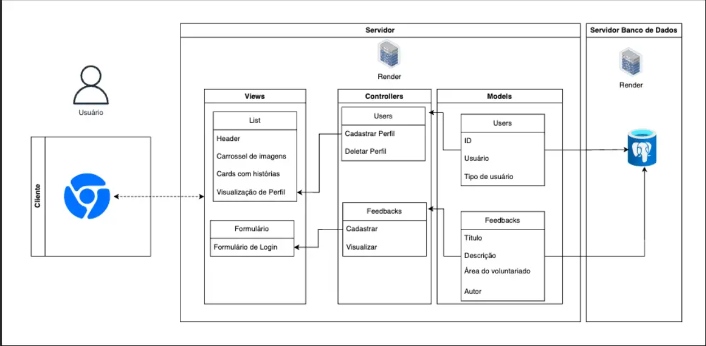

# Nome do Projeto: Plataforma VTM (Voluntariado Transformador Massivo)

## Descrição
A plataforma VTM tem como objetivo facilitar a interação entre voluntários e ONGs, atuando como uma rede social para o compartilhamento de experiências e promoção de ações sociais.

## Arquitetura
MVC (Model-View-Controller)

### Ferramenta de Diagramação
draw.io

## Modelos (Models)
- **User**: Gerencia informações dos usuários, incluindo ID, nome, tipo (voluntário, ONG), e tags.
- **Action**: Registra ações promovidas pelos usuários, contendo detalhes sobre o evento, localização e participantes.
- **Tag**: Categorias que os usuários podem adicionar a seus perfis, como causas e habilidades.

## Controladores (Controllers)
### UserController
- **Cadastrar**: Cria um novo usuário ou ONG no sistema.
- **Deletar**: Remove um usuário ou ONG do sistema.

### ActionController
- **PromoteAction**: Permite que um usuário crie e promova uma nova ação social.

### TagController
- **AddTag**: Adiciona tags ao perfil de um usuário.
- **RemoveTag**: Remove uma tag do perfil de um usuário.

## Views (Views)
- **User Profile View**: Mostra o perfil do usuário, suas tags, ações que promoveu ou participou, e um feed de atividades.
- **Action View**: Exibe detalhes de ações sociais, incluindo como participar ou contribuir.
- **Tag Selection View**: Permite que os usuários selecionem ou removam tags de seus perfis.

## Infraestrutura
A plataforma usa o banco de dados PostgreSQL e é desenvolvida com a linguagem JavaScript com auxílio do framework Sails.js. Esta combinação oferece uma arquitetura eficiente e adaptada às necessidades específicas de gerenciamento de dados complexos e operações relacionadas ao voluntariado.

## Implicações da Arquitetura
O MVC ajuda a manter o projeto organizado, separando as diferentes partes do código e tornando mais fácil para atualizar e encontrar problemas. Com essa estrutura, pode-se adicionar novas funcionalidades sem mexer em tudo e isso ajuda a manter a plataforma rodando sem problemas enquanto fazemos melhorias.
